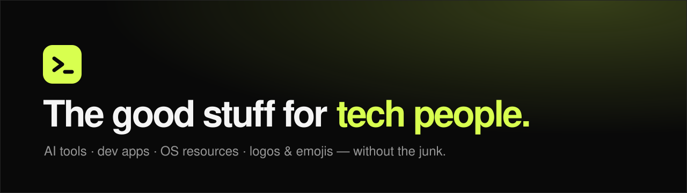

<div align="center">



<br />

**One place to find actually useful tech resources, without digging through random posts and outdated lists.**

<br />

<a href="https://izzyfrm.github.io/tech-stuff/"></a>
<a href="https://izzyfrm.github.io/tech-stuff/emojis.html"></a>
<a href="https://discord.gg/R9T3vFXkje"></a>
<a href="CONTRIBUTING.md"></a>

</div>

<br />

## ✨ What's inside

| | Category | What you'll find |
|---|---|---|
| 🤖 | **AI tools** | Coding agents and assistants worth your time |
| 💻 | **Apps & editors** | Editors, browsers, and daily drivers |
| 🖥️ | **Operating systems** | Windows, Linux, and macOS resources |
| 📰 | **News** | AI and tech sources that aren't noise |
| 🔧 | **Developer tools** | Hosting, version control, terminals |
| 🎨 | **Design** | Icon sets, SVG libraries, and assets |
| 📚 | **Learning** | Docs, courses, and hands-on practice |
| 🔒 | **Privacy** | Browser and privacy-friendly picks |

## 😎 Emoji & logo library

<p>
  &nbsp;
  &nbsp;
  &nbsp;
  &nbsp;
  &nbsp;
  &nbsp;
  &nbsp;
  &nbsp;
  &nbsp;
  
</p>

**58 transparent tech logos** as SVGs in [`/emojis`](emojis/). Use the [emoji page](https://izzyfrm.github.io/tech-stuff/emojis.html) to search them and export a **256×256 transparent PNG**, which is ready for Discord custom emojis.

## 🚀 Run it locally

It's plain HTML, CSS, and JavaScript. There's no build step.

```bash
git clone https://github.com/izzyfrm/tech-stuff.git
cd tech-stuff
python -m http.server 8000
```

Then open <http://localhost:8000>.

## 🤝 Contributing

Found something that belongs here? [Open an issue](https://github.com/izzyfrm/tech-stuff/issues/new) or send a pull request.

Good submissions are useful, safe, actively maintained, relevant to developers, creators, AI users, or tech fans, and free of referral spam. The full guidelines are in [CONTRIBUTING.md](CONTRIBUTING.md).

To add a resource, add one entry to the `resources` list in [`assets/app.js`](assets/app.js). If a matching logo already exists in [`/emojis`](emojis/), set `logo` to its file name without `.svg`.

## 🗂️ Project structure

```
tech-stuff/
├─ index.html        resource directory
├─ emojis.html       emoji & logo library
├─ emojis/           58 transparent SVG logos
├─ assets/
│  ├─ style.css      shared styles
│  ├─ app.js         resource list + search/filter
│  ├─ emojis.css     emoji page styles
│  ├─ emojis.js      emoji grid + PNG export
│  ├─ logo.svg       site logo / favicon
│  └─ banner.svg     README banner
├─ CONTRIBUTING.md
└─ README.md
```

## ⚖️ Trademarks

Brand names and logos belong to their respective owners. See [`emojis/README.md`](emojis/README.md) for sources and licensing notes.

---

<div align="center">

Built and maintained by [@izzyfrm](https://github.com/izzyfrm) 💚

</div>
